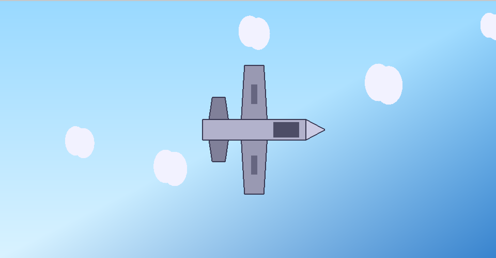

# OpenGL Airplane Animation

A lightweight 2D airplane animation built in **C** using **OpenGL** and **GLUT**.  
The project demonstrates basic graphics programming, animation techniques, and modular scene rendering.

---

## Features

-   Gradient sky background
-   Seamless, animated cloud movement
-   Custom airplane model (body, wings, tail, nose, details)
-   Smooth 60 FPS animation with timer-based updates
-   Modular and readable codebase

---

## Screenshot



---

## Getting Started

### macOS (Homebrew)

1. Install dependencies:

    ```sh
    brew install freeglut
    ```

2. Build and run:

    ```sh
    gcc main.c -I/opt/homebrew/include -framework OpenGL -framework GLUT -o airplane && ./airplane
    ```

### Windows (MinGW)

1. Install [MinGW](http://www.mingw.org/) and [FreeGLUT binaries](http://www.transmissionzero.co.uk/software/freeglut-devel/).
2. Place the FreeGLUT files:

    - Headers (`freeglut.h`, etc.) → `C:\MinGW\include\GL\`
    - Libraries (`libfreeglut.a` or `.lib`) → `C:\MinGW\lib\`
    - DLL (`freeglut.dll`) → same directory as the executable or in `C:\Windows\System32\`

3. Build and run:

    ```sh
    gcc main.c -lfreeglut -lopengl32 -o airplane.exe
    airplane.exe
    ```

### Code::Blocks

1. Create a new empty project.
2. Add `main.c`.
3. In **Build Options → Linker Settings**, add:

    ```
    freeglut
    opengl32
    ```

4. Build and run.

### Visual Studio Code

1. Open the project folder in VS Code.
2. Install the Microsoft **C/C++ extension**.
3. Use the terminal to compile with the commands provided above,
   or configure a `tasks.json` for one-click build and run.

Example `tasks.json`:

```json
{
    "version": "2.0.0",
    "tasks": [
        {
            "label": "Build and Run Airplane",
            "type": "shell",
            "command": "gcc main.c -lfreeglut -lopengl32 -o airplane.exe && airplane.exe",
            "group": {
                "kind": "build",
                "isDefault": true
            },
            "problemMatcher": ["$gcc"]
        }
    ]
}
```

---

## Project Structure

-   `main.c` — Rendering and animation logic
-   `README.md` — Project documentation

### Code Organization

-   Independent functions for each scene element (sky, clouds, airplane, etc.)
-   OpenGL primitives: `GL_QUADS`, `GL_TRIANGLE_FAN`, `GL_LINE_LOOP`
-   Animation via timer callback and global offset variable

---

## License

This project is open source and available under the MIT License.
